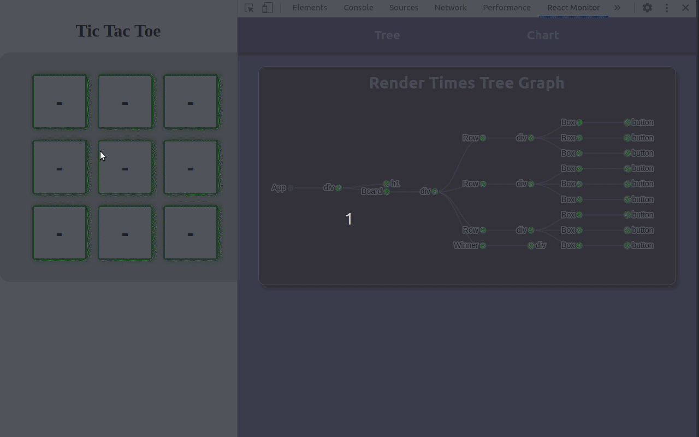

# ReactMonitor

Quickly visualize React's component tree performance for improved onboarding and debugging

## What does it do

By using the ReactMonitor Chrome DevTool, beginning and experienced developers alike are able to get a visual representation of an existing codebase that they are working on. Built with React, this tool will dynamically traverse the fiber root object behind the scenes, displaying state, props, render times and the type of components on the page.

## How to install and run

To be able to use the application, users can:

- Download the 'ReactMonitor' Google Chrome extension from [The Chrome Web Store](https://chrome.google.com/webstore/detail/reactmonitor)

- Navigate to the domain of your React application that you will be running React Monitor on

- Open your Chrome Developer Tools and select React Monitor

- You are now able to view state changes on your application in real time!

### Method 2: Clone this repository

- in the root directory of the clone run `npm build`

- in Chrome -> extensions, enable developer mode

- select add new unpackaged extension

- in the folder selection window, select the _dist_ folder

Requirements:

- reactmonitor will only search in children (depth 1) of `<body>` for the HTML element where a React DOM is rendered only ([issue #10](https://github.com/React-Monitor-2-0/ReactMonitor/issues/10))

- app to be tested needs to include React versions that use Fiber Tree (such as React 16)

- app to be tested need to be in a development build of React or a Production build with React Profiler enabled

## Contributing

As an open-sourced project, ReactMonitor gladly accepts help whenever possible. If you have suggestions for improvements or run into any bugs, please feel free to open a github issue after checking whether no such issue has been filed yet. When you file a github issue, please include the following information:

#### Description

##### Steps to Reproduce

###### 1.

###### 2.

###### 3.

##### Expected behavior:

##### Actual behavior:

##### Reproduces how often:

##### Versions: x.x

##### Additional Information:

## Authors

**Rudo Hengst:** [@RudoH](https://github.com/RudoH)\
**Lia Pham:** [@lpham598](https://github.com/lpham598)\
**Tommy Han:** [@simple-sifu](https://github.com/simple-sifu)\
**Nay Linn:** [@naylinnpkv](https://github.com/naylinnpkv)\
**Hamoud Ebnou:** [@Ebnouhamoud](https://github.com/Ebnouhamoud)\
**Dan Bitsmith:** [@bitsmith-ny19](https://github.com/bitsmith-ny19)\
**Philip Rodrigues:** [@Malvado996](https://github.com/Malvado996)

## License

This project is licensed under the MIT License - see the [LICENSE](./LICENSE) file for details
